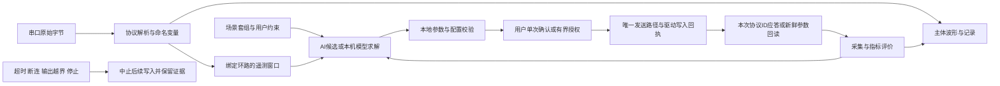

# 场景 AI 串口助手：实施与验收计划

版本日期：2026-09-30。本文描述目标产品、当前源码中的实现边界，以及可以逐项执行的验收动作。测试通过、独立构建成功、浏览器操作、原生窗口操作、设备协议确认和真实控制对象验收分别记录；任何一层不能代替下一层。

## 产品定位与功能取舍

默认页面服务于嵌入式工程师每天的连接、收发、观察和记录。初学者通过空状态和字段说明完成相同流程，学生使用有明确标签的演示数据或离线模型。AI 在同一串口、协议和变量上下文中帮助分析与调参，打开侧栏时仍能看见主体波形和当前设备状态。

主界面保留四类内容：连接与采集状态，原始收发与快捷命令，协议遥测与实时波形，记录/回放与上下文 AI 辅助。PID、仿真和频域分析随场景需要出现。复杂图表、3D、通用聊天、多套重复的项目编辑器从默认流程收敛；源码中的高级能力可保留供后续入口使用。

外部参照以 2026-09-30 核实的仓库文档为依据，不用 star 数量判断产品质量，也不直接复制这些项目的代码或功能数量：

| 参照 | 可借鉴的行为 | 本产品采用方式 |
| --- | --- | --- |
| [Serial Studio](https://github.com/Serial-Studio/Serial-Studio) | 项目定义数据格式后生成遥测视图；支持命令、记录和回放 | 一次协议映射服务波形和 AI，能力按任务出现；不因为参照具备更多传输类型就扩张默认范围 |
| [PlotJuggler](https://github.com/PlotJuggler/PlotJuggler) | 实时与记录数据共用信号分析，可对齐和比较不同运行 | 保持变量命名、单位、时间与来源，围绕同一响应窗口比较试验 |
| [COMTool](https://github.com/Neutree/COMTool) | 连接配置复用、文本/HEX、发送历史、快捷发送、可扩展协议 | 日常操作统一发送路径，协议处理与界面解耦，扩展不能绕过发送权限和停止屏障 |
| [SerialTest](https://github.com/wh201906/SerialTest) | 收发、波形和快捷控制并排，接收与界面更新分离 | 默认保持收发和波形清晰，控件动作可解释，暂停显示、暂停采集、停止发送的状态分开 |

TypeSafe 的当前文档要求把已知规则、计算与执行留给代码，语义判断用于有边界的选择。见 [构建指南](https://docs.typesafe.ai/concepts/how-to-build-with-system-one.md)。本轮 Jev 实际用于五项功能分组：串口和遥测归为日常核心，场景 AI 和仿真归为上下文增强，默认独立通用工作台归为后置。控制数学、设备权限、模型推导与本地保护仍由 Codex/确定性代码处理；Jev 分类不构成硬件验收或发布证据。

实际工具记录：`jev_classify`，provider `typesafe`，model `jev-latest`，5 个分类、5 个自动分组、0 个需复核、0 个无效响应。串口/遥测选择 daily_core 的概率为 1/1，场景 AI/仿真选择 contextual_extension 的概率为 0.95/0.91，默认泛化工作台选择 defer 的概率为 1；输入/输出用量为 1188/243 token。分类阈值是 top probability 0.85 和第一/第二选项差值 0.5，仅用于这次功能分组。

## 必须纠正的前提

质量和半径本身不足以求出可用的 PID。真实系统还需要执行器输入增益、惯量或等效对象、阻尼/时常、控制方向、输入输出单位、工作点、采样周期和延迟。对于串级控制，外环对象包含已闭合内环；仅填写整车质量不能跳过内环建模。

AI 从描述得到的是模型草稿。用户填写缺失物理数据、核对公式、线性化假设和适用范围之后，模型才能进入本机计算。传递函数、频域裕度、离线仿真都不能证明设备正在运行该控制器。设备固件的 PID 形式、积分/微分是否已乘除采样周期、限幅和抗饱和实现也必须匹配参数单位。

“AI 全自动调参”在产品中对应一次明确授权范围内的自动反馈试验：已有可运行控制基线，固定环路、参数范围、变化幅度、轮数、观察时间、遥测时效、设备确认和停止条件。它不表示从零参数自动扶起开环不稳定的平衡车，也不表示无人机自动完成空中全轴联调。范围内自动执行必须具备独立设备保护及真实固件确认；串口软件停止不能替代下位机保护。

## 两条使用路线

用户先选择平衡车、飞控或自定义套组，再选择控制结构和当前环。每个套组实际包含约束提示词、物理模型说明与字段、声明式技能和支持的本机/AI 工具。它们随请求和试验记录传递，禁止作为装饰性标签或自动授予任意代码执行权。

| 场景 | 控制结构 | 物理模型路线 | 自动反馈路线 |
| --- | --- | --- | --- |
| 平衡车 | 单直立；直立内环 + 速度外环 | 小角度倒立摆和执行器近似；每项数值由用户提供；外速度环需已验证内环的等效对象 | 仅调整当前选定环，要求保守稳定基线；角度、轮向和参数命令需核对 |
| 飞控 | 单角速度；角速度内环 + 姿态外环 | 单轴惯量、力矩增益、阻尼和执行器近似；姿态外环使用完整内环 PID、反馈增益与单位变换，或经核对的闭环等效对象 | 当前轴/当前环的台架或用户明确配置的安全试验；不假定三轴耦合或飞行状态已验收 |
| 自定义 | 用户定义 P/PI/PD/PID 单环，或有序串级环 | 数值系数 S 域传递函数；或从描述生成公式草稿与所需字段，填写并审核后物化模型 | 用户配置提示词、变量、单位、命令、范围和确认方式；执行器仍保留本地限制 |

物理模型路线可在未连接设备时计算候选，所需门槛是有效模型、模型确认、方向、控制结构、采样周期和频域目标。设备通道、当前生效基线和发送边界属于之后的执行门槛。离线候选始终显示“未下发/未实机验证”，不能因本机解算通过就变为设备当前值。

串级模式按内环到外环逐环配置和验收。每个环具有自己的输入输出、周期、基线、命令和记录。当前实现的逐环选择不应被描述为已实现无监督的整组串级联合寻优；自动移交到下一环和跨环一致性验收需要独立实现和证据。

## 数据与执行边界

驱动写入、设备生效与目标通过是三个独立状态。协议应答使用发送前创建并嵌入命令的 `protocolRequestId`；驱动回执使用传输层 `writeRequestId`。设备只能应答它收到的协议 ID，不能要求设备猜测发送完成后才生成的驱动 ID。例如命令模板 `PID,{request_id},{id},{kp},{ki},{kd}`，设备应答 `PID_APPLIED {request_id}`。

当前参数回读必须来自本次驱动写入之后、同一通道世代和当前已绑定变量。数据陈旧、断连或重新连接使旧确认失效。参数回读证明配置值与候选相符，不证明全部物理响应已符合目标。

AI 服务只得到项目/所选环、提示词和技能、物理模型及假设、单位、参数、边界和指标摘要。首次外发摘要需要明确用户操作。原始串口日志和完整波形不自动发送。请求前冻结输入，返回后核对计划签名，候选关联固定计划；改动通道、命令、模型或边界后必须重新生成候选。

停止后保留已写命令、回执、确认和评价记录。软件重新启动不会自动恢复执行，历史参数不能被当作新设备当前值；重新核对基线和重新授权后才能开展下一次试验。恢复原参数也是新的受控写入，不能把一个“恢复”按钮或旧记录当作设备已恢复的证据。

## 声明式套组与开源交付

套件采用 `com.llm-serial.tuning-package` 版本 1。导入仅接受长度受限的文本、有限数值/空值、支持的控制结构、物理模型、提示词技能及 `local.pid-solver` / `ai.feedback-candidate` 工具。不得执行套件内的脚本、shell、网页或远程插件。AI 模型表达式由有界数学解析器物化，支持明示的算术和函数，不使用 `eval`。

导入重置设备基线、已生效确认和模型人工确认。格式检查通过意味着可载入草稿，执行校验通过才允许进入设备流程。套件文件、历史记录和当前设备状态在界面中应有明确来源标签。

本地根目录当前未发现产品许可证文件，不能把源码可见当作已完成开源授权。开源发布前需要用户决定产品许可证，补充贡献指南、变更日志、依赖许可清单、协议示例、构建说明和验收矩阵。参照项目只用于行为学习；若未来复用源码，另行核对对应文件的许可证和再分发义务。本轮不替用户作不可逆的许可证或公开发布决定。

独立构建输出位于专属 `output`/暂存目录，既有 `release/LLM串口.exe` 与 `release/data` 必须保持。构建脚本不得在声称独立构建时复制覆盖现有 `release`。本轮发现并修复的具体问题是便携构建末段仍向 `release` 复制；新流程改为唯一的构建输出目录，并通过 Tauri 前端目录覆盖绑定本次前端产物。正式证据还需记录实际构建目录、源文件哈希/工作区状态、退出码、产物哈希及是否发生构建期间源码变化。

## 可执行的实施顺序

| 阶段 | 具体实施 | 退出条件 |
| --- | --- | --- |
| A 日常流程收敛 | 主体收发/波形保持可见，AI 侧栏集成，统一状态词、快捷命令和控件发送反馈，仿真复用视觉变量 | 浏览器按下表完成布局、收发、协议、回放操作；不误标暂停/断开/演示 |
| B 套组与两路线 | 平衡车/飞控/自定义选择；环路结构；物理输入与传递函数；AI 模型草稿动态字段；有效工具分发 | 确定性测试覆盖数值模型、草稿缺失输入、错误公式、反向增益；离线候选可生成且不可直接下发 |
| C 当前环反馈执行 | 冻结 AI 输入、配置签名、限幅、单轮变化、驱动回执、协议 ID ACK/新鲜回读、评价窗口、预算、停止和记录 | 受控交互/协议夹具证明每个拒绝分支；真实设备另行执行硬件矩阵 |
| D 串级持续实现 | 环路档案隔离；已验收内环结果显式交给外环；多环状态显示；安全条件下移交与回滚 | 单环与多环记录能分辨；内环证据过期或改变时外环不能继续自动执行 |
| E 开源候选交付 | 专属目录独立构建、可检查源码快照、贡献/许可/固件文档、验收证据与哈希 | 源码与产物身份一致，许可证已明确；原生和硬件未验收项目如实列出 |

不能通过隐藏必需字段、跳过模型审核或把失败降为演示成功来满足退出条件。允许短期未实现项，但必须记录在验收状态和下一步实施中。

## 验收矩阵与证据

| 编号 | 操作或输入 | 期望结果 | 所需证据层 |
| --- | --- | --- | --- |
| U01 | 打开默认页和 AI 侧栏，1200 px 与窄窗口，键盘 Tab/关闭 | 当前波形仍可辨认；控件不重叠；聚焦/退出路径明确 | 当前源码浏览器截图与操作 |
| U02 | 平衡车、飞控、自定义逐一选，切换结构与当前环 | 支持结构正确；旧模型、旧基线和未下发候选不串用 | 浏览器操作 + 单元测试 |
| U03 | 物理模型路线不连接设备，填写确认数据、周期与目标 | 可计算候选；缺失物理字段列出；写入入口保持禁用 | 浏览器操作 + 数学测试 |
| U04 | 自定义模型描述生成草稿，填写动态字段，改变输入，再确认 | 无编造的默认物理值；输入改变清除模型确认；表达式安全物化 | 受控 AI 响应/本机测试；真实服务请求另列 |
| U05 | AI 返回后修改命令、通道、边界或模型，再尝试下发旧候选 | 计划签名不匹配时拒绝；必须重新生成 | 交互回归 + 签名单元测试 |
| T01 | NaN、不同长度响应数组、缺失采样、陈旧通道 | 不计算通过指标，不外发 AI 参数建议，不开始观察 | 确定性测试 + 交互 |
| T02 | 手工候选与有界自动模式，边界外值/过大变化/非活动 PID 项 | 本地拒绝，设备发送调用次数为零 | 执行链夹具/测试 |
| T03 | 写入排队、写入失败、旧回执、会话变化 | 不提升为设备确认，不采集评价，不发送下一轮 | 传输/关联测试 + 原生驱动验收 |
| T04 | 正确协议 ID ACK、旧 ID ACK、泛化 OK、无 ACK 超时 | 仅本轮 ACK 可确认；无有效确认暂停，保留未知生效状态 | 设备协议夹具 + 真实固件 |
| T05 | 本次写入前的参数回读、旧世代回读、写后有效回读 | 仅写后同世代活动参数一致时确认 | 关联测试 + 真实固件 |
| T06 | 观察中停止、采集暂停、软件停止屏障、断连、遥测过期、输出越界 | 中止后续参数；记录准确；未完成窗口不能通过 | 交互 + 原生/硬件分别执行 |
| T07 | 达成目标、耗尽轮数、AI 超时/拒绝 | 有限结束，不重复无限请求；达标只表示本次设定遥测窗口通过 | 受控 AI/遥测试验 |
| R01 | 重启软件和导入套件 | 重新核对基线与模型；不恢复旧自动授权；恶意/错误结构拒绝 | 存储/导入测试 + 原生重启 |
| R02 | 独立构建前后核对原 release EXE 哈希，审查包内路径 | 原 EXE 保持，产物写入新目录；包内排除既有 `release/data`，不读取或哈希用户数据内容；清单绑定本次源码/产物 | 构建日志、EXE 哈希、包条目、manifest |
| H01 | 实际串口占用、拔插、乱码/分帧、高速接收、周期/控件写入 | 错误可见，显示与记录同步，停止屏障阻断后续普通发送 | 原生窗口 + 真实串口 |
| H02 | 台架平衡车/飞控单轴/自定义对象逐环核对方向、命令、保护、响应 | 固件参数形式和单位一致，保护有效；测量指标可复现 | 对应设备/固件/台架记录 |

源码检查与快速测试命令：`npm run test:tuning`、`npm run test:transport`、`npm run test:widget`、`npx vue-tsc --noEmit`。完整前端检查使用 `npm test`；完整发布检查使用 `npm run check:release`，其中 Rust、依赖审计必须保留实际日志和退出码。独立构建按当前构建脚本参数选择专属路径，不使用旧 EXE 代替本次产物。

本轮执行审计的 `npm run test:tuning` 已通过：覆盖离线候选/执行门槛拆分、反向增益、旧候选配置签名、协议 ID、指标异常、参数约束、导入结构与确认重置、重启暂停，以及 AI 模型草稿字段校验。它没有执行真实 AI 服务、Windows 原生窗口或硬件台架。全局类型检查、完整测试、独立构建和 UI 验收由本轮总验收记录填充；本文不提前声明通过。

## 当前支持与未完成状态

浏览器回归补充覆盖独立环节恢复、受控 AI 服务的模型拒绝/缺失物理字段/有效草稿、已确认 G(s) 的离线候选和仿真预测。模型编辑不再把未提交的系数覆盖；手动模型来源不会误标为实测辨识；示例切换到手动填写时清除示例物理数值。候选、写入及确认变化独立触发记录保存，重载仍清除人工模型与设备确认，不恢复执行授权。960 窗口的发送和图表工具按可用宽度收纳，重复 AI 标题与套组工具收进渐进配置。各项实际证据与未验收范围以总验收报告为准。

当前源码提供场景套组、所选环的两种路线、声明式技能/工具、AI 模型草稿解析、本机物理/数值传递函数计算、候选约束、配置签名、关联回执/确认及有限试验路径。各环独立保存模型输入草稿、命令、候选和历史；切换、重新载入及重启均清除设备与模型人工确认。当前环的试验继续受通道世代、独占发送、遥测新鲜度和输出范围约束，人工确认等待期间也不能绕过这些限制。

本轮独立源码复核发现并修复了计划变更后返回的 AI 候选、人工确认等待的授权失效、基线编辑保留旧确认、输出保护停止链以及数值格式精度问题。复核结论、浏览器的受控 AI 服务记录、有效尺寸截图及最终独立构建身份分别保存在 `output/scenario-ai-20260930` 和 `output/builds`，由总验收报告区分源码、浏览器、原生与设备证据。开发服务器也排除监视独立构建目录，避免打包期间 Windows 文件锁使界面验收服务退出。新增功能只有完成与之相称的测试后才能列为已验证。

尚无本轮真实设备证据证明平衡车、飞控和自定义对象完成自动调参验收。整组串级联合寻优、真实上下位机保护/恢复、各模型对实际固件的参数一致性、原生窗口当前产物运行与开源许可证决定分别保持未完成/待验收。对外用语应为“源码实现/测试通过/候选构建/待设备验收”等具体状态，不使用主观成熟度分数或“发布完成”。
